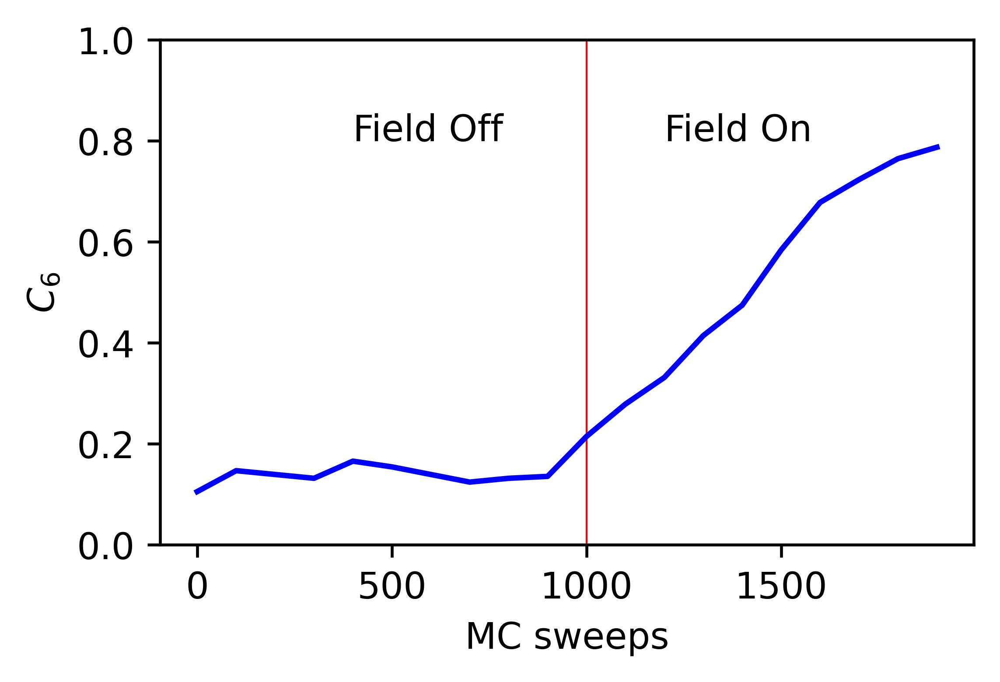
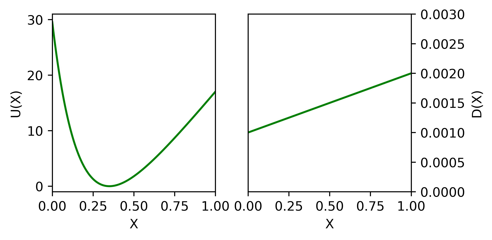
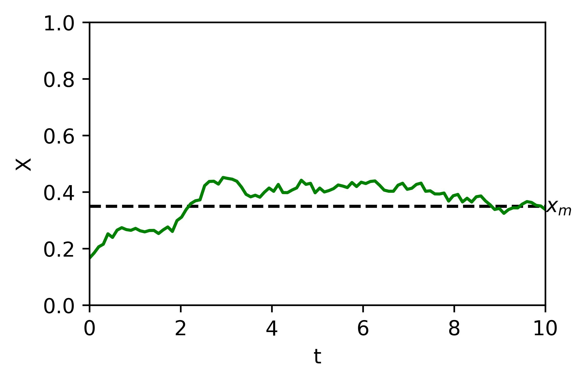
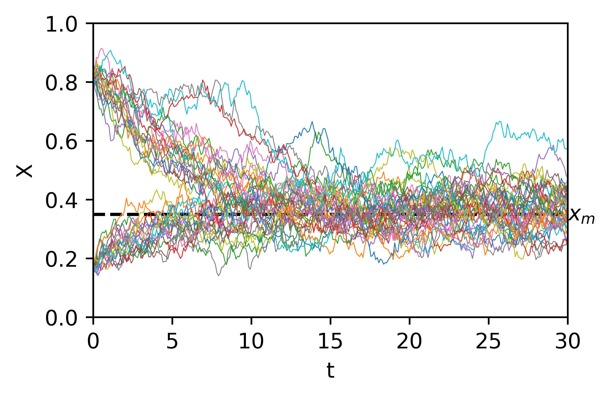
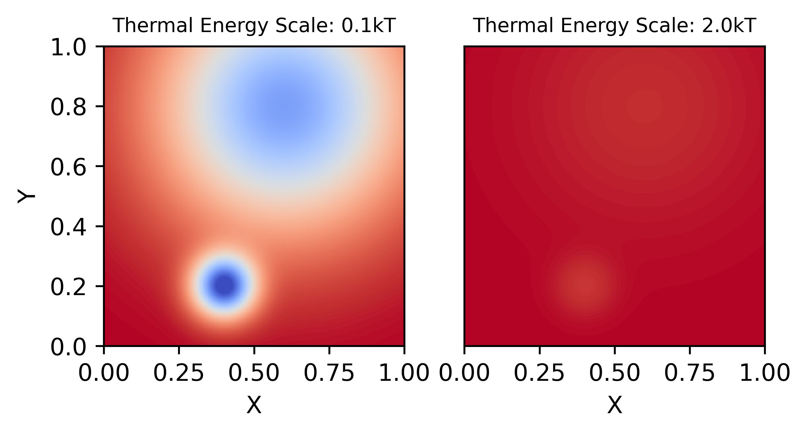
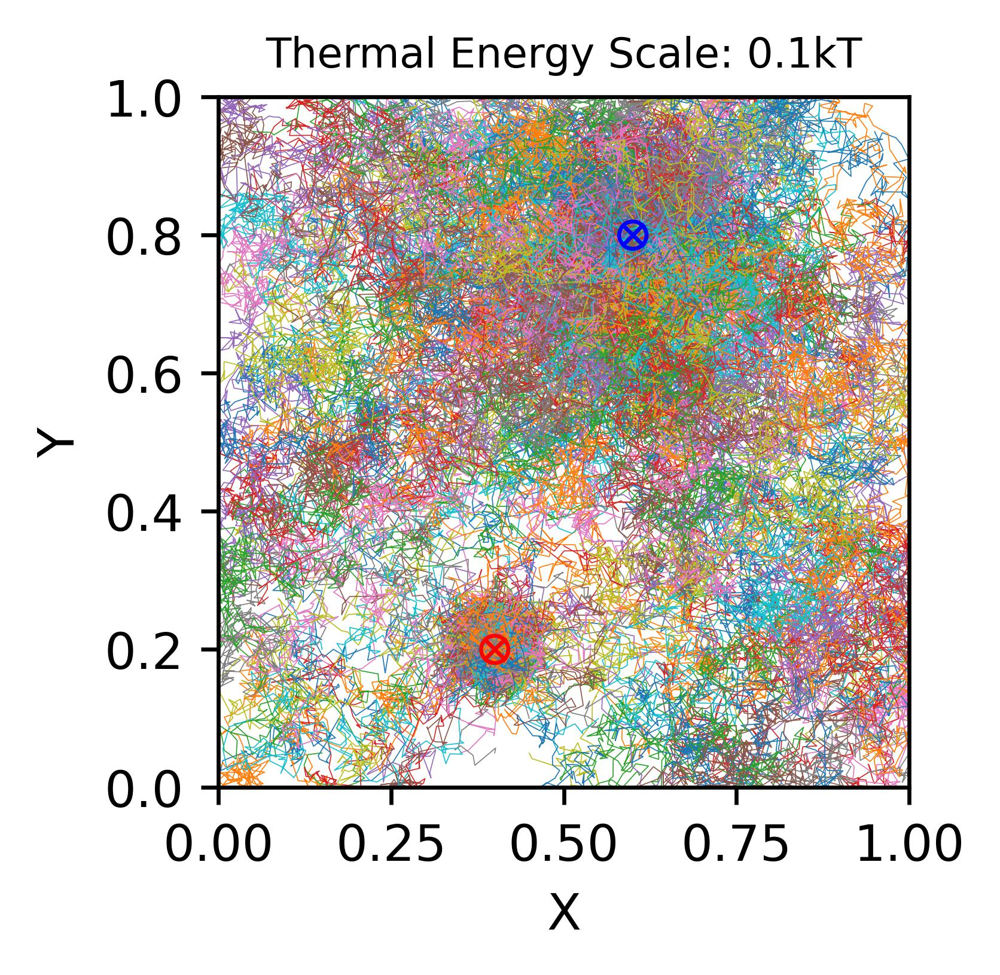
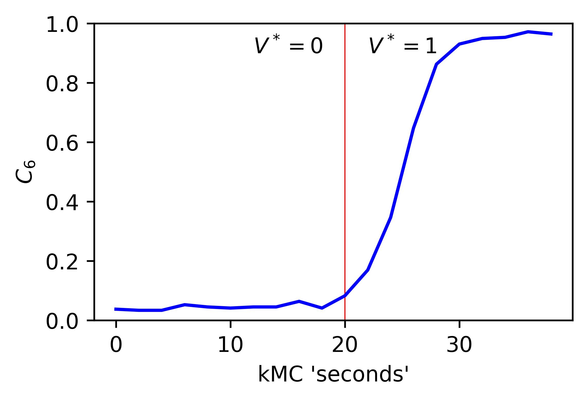

Simulations
===========

The overarching goal of SMRL is to collect a variety of control problems in soft matter and express them in a common language so that reinforcement learning methods may be applied interchangably between problems. In this way, lessons learned from one system can translate to better controlling another.

The smallest and most basic component of this common language is the simulation object, whose purpose is to translate a system with specific physics into the common format which SMRL relies upon. `hoomd-blue`_ is a powerful tool for simulating a variety of soft matter physics, and by far the majority of simulation classes in SMRL use hoomd as their engine. So, for the purposes of this tutorial we'll assume a basic proficiency with hoomd-blue, and refer the reader to their excellent `tutorials`_ if they are unfamiliar.

.. _tutorials: https://hoomd-blue.readthedocs.io/en/latest/tutorial/00-Introducing-HOOMD-blue/00-index.html#
.. _hoomd-blue: https://hoomd-blue.readthedocs.io/en/latest/

In this tutorial we'll walk through the process of creating a custom simulation object. Once created, a simulation class can seamlessly integrate into any of the SMRL *environments*. In turn, SMRL *agents* (which actually do reinforcement learning) are designed with one or more of these *environments* in mind. Essentially, a simulation class is all that's needed to leverage all of SMRL onto any novel problem. While SMRL has several of these simulation classes in-built, users will often need to write their own and so this tutorial is here to help!

The Simulation Base Class
*************************

Below we've included a snippet of the SMRL :doc:`documentation <modules>`. This documentation describes the base class for simulations. The key elements of a simulation are some way to initialize a system, we'll call that :code:`reset()`, some way to evolve the system over time, :code:`run()` and some way to characterize the system, :code:`state`. Simbase defines the common language with which many soft matter systems may be programmed.

.. autoclass:: sims.base.Simbase
    :members: run, reset, state
    :undoc-members: dims
    :no-index:

Inheriting Simbase
******************

All *environments* rely these methods and properties from the base class, and so when creating a new simulaton class we need to properly override the key parts of Simbase. Below we'll walk through how to create one of these classes using the example of noninteracting ('free') particles undergoing Brownian motion.

First, define a class which inherits Simbase. The constructor for this class should contain everything needed to specify it's instance.

.. code-block:: python

    import numpy as np
    import gsd.hoomd
    import hoomd
    from sims import Simbase

    class ideal_BD(Simbase):

        def __init__(self, N:int, L:float, D0:float=0.25, kT:float=1.0, dt:float=1e-3):
        """
        Constructor method defines everything needed to run a simulation
        """

        self._BD = {'kT': kT, 'D0': D0, 'dt': dt}
        self._N = N
        self._L = L
    
    ...

It is useful to assign properties to these simulation objects, some of which might be settable. The most important property is :code:`state` because **all** *environments* reference this state. :code:`state` always returns a tuple of order parameters. In this case we've used the radius of gyration, but in general this can be any calculation or, even more generally, any set of calculations.

.. code-block:: python

    ...
        
        @property
        def state(self)->tuple:
        """
        state property calculates one or many order parameters and returns them as a tuple
        """
            if not hasattr(self, "sim"), Raise Exception("reset simulation before querying snapshot")
            pts = self.sim.state.get_snapshot().particles.position
            com = np.mean(com,axis=0)
            rad2 = np.linalg.norm(pts-com)**2
            Rg = np.sqrt(rad2.mean())
            
            return (Rg,)

        @property
        def kT(self) -> float:
            return self._BD['kT']
        
        @kT.setter
        def kT(self,kT:float):
            self._BD['kT']=kT

        @property
        def D0(self) -> float:
            return self._BD['D0']
        
        @D0.setter
        def D0(self,D0:float):
            self._BD['D0']=D0
        
        @property
        def dt(self)-> float:
            return self._BD['dt']

        @property
        def num_particles(self) -> int:
            return self._N

        @property
        def box_size(self) -> float:
            return self._L
    
    ...

Finally, we must define the :code:`reset()` and :code:`run()` methods which are also referenced by *environments*. :code:`reset()` may take kwargs, but :code:`run()` always takes two paramters. The first defines some length of time (or monte carlo sweeps, etc) to run the simulation over. The second defines some action to take, in this case applying an active force in the x-direction. Note that the :code:`state` property accesses the internal particle confifuration of a `hoomd` simulation, and so raises an exception if said simulation hasn't been instantiated by :code:`reset()`.

.. code-block:: python

    ...

        def reset(self, N=100,L=20):
            """
            reset methods has keyword arguments which modulate how the simulation starts.
            """
            super().reset()
            self._N = N
            self._L = L

            #create a gsd frame object
            frame = gsd.hoomd.Frame()
            frame.configuration.box = [L,L,0,0,0,0]
            frame.particles.N = N
            frame.particles.position = np.zeros((N,3))
            frame.particles.typeid=[0]*N
            frame.particles.types=['A']
            
            # initialize hoomd simulation from the random frame
            self.sim = hoomd.Simulation(device=hoomd.device.CPU())
            self.sim.create_state_from_snapshot(frame)

        def run(self, time, force):
        """
        run method takes in some kind of action and steps the hoomd simulation forward accordingly
        """
            super().run(time,action)

            act = hoomd.md.force.Active(filter=hoomd.filter.All())
            act.active_force['A'] = [force,0.0,0.0]

            # instantiate BD stepper with the forces defined above
            BD = hoomd.md.methods.Brownian(filter=hoomd.filter.All(),
                                        default_gamma=self.kT/self.D0,
                                        kT=self.kT)
            integrator = hoomd.md.Integrator(dt=self.dt, methods = [BD], forces=[act])

            # apply forces to integrator and run for one simstep
            self.sim.operations.integrator = integrator
            simstep = int(time/self.dt)
            self.sim.run(simstep)
            self.sim.operations.integrator = None

Assigning Modular Order Parameters
**********************************

Often it is useful to compare the controllability of multiple order parameters, or characterize the system with a long *vector* of order parameters for use in dimensionality reduction. Most of the SMRL simulations are set up with modularity in mind, so that the :code:`state` property returns a generalized vector of order parameters. In turn, most simulations accept a callable function as part of their constructor which is then assigned to their :code:`state` property. Below we've presented an much-abbreviated version of some source code within :py:mod:`sims.hpmc` as an example of how to implement this functionality.

.. code-block:: python
    
    import numpy as np
    import gsd.hoomd
    import hoomd
    from sims import Simbase

    class Quadrupole(Simbase):
        def __init__(self,
                N: int,
                state_functional,
                diameter = 1.0,
                dg = 30.0):
            """
            Constructor method accepts a callable state functional
            which computes order parameters on the 2D configuration
            of particles in the 
            """
            super.__init__()
            self._N = N

            self._lambda_f = state_functional

            # use Electrodes class to easily relate applied field conditions to methods within hoomd-blue
            qpole = Electrodes(n=2,dg=dg)
            qpole.direct = np.array([0,np.pi/2])
            self._elec = qpole

            self._2a = diameter

        @property
        def state(self):
            # state property calls the state functional from the constructor
            if not hasattr(self,'sim'): raise Exception("reset simulation before querying snapshot")
            pts = self.sim.state.get_snapshot().particles.position
            return self._lambda_f(pts)

        def reset(self, **kwargs ):
            # resets the particle configuration
            super().reset()
            self.sim = hoomd.Simulation(device=hoomd.device.CPU())
            ...

        def run(self, sweeps:int, quad_coeff:float):
            # runs the monte carlo simulation for sweeps under
            # an external field characterized by quad_coeff
            super().run(sweeps, quad_coeff)
            ...

            self.sim.run(sweeps)

            ...

    # Note that this class doesn't actually exist as written, it's a synthesis of code withom sims.hpmc.Multipole and sims.hpmc.Quadrupole

When istantiating a :py:class:`Quadrupole <sims.hpmc.Quadrupole>` object, the user must do so using these callable order parameter functions which define its state property. For example, below we've used the :py:mod:`pchem.order` module to assign the :py:meth:`C6 <pchem.order.crystal_connectivity>` order parameter to a 100-particle HPMC :py:class:`Quadrupole <sims.hpmc.Quadrupole>` object. Finally, before we can run a simulation we must :code:`reset` it to an intial state, in this case the initial state will be random collection of discs generated by :py:meth:`utils.hoomd_helpers.random_frame`:

.. code-block:: python

    import sims
    import pchem
    from utils import random_frame

    def C6(pts):
        #finds neighbors
        nei = pchem.order.neighbors(pts)
        #computes order parameter
        psis, _ = pchem.order.bond_order(pts,nei)
        C6s = pchem.order.crystal_connectivity(psis,nei)
        return (C6s.mean(),)

    L = 20
    monte = sims.hpmc.Quadrupole(100,C6,dg=L)
    init = random_frame(monte.num_particles, L)
    monte.reset(init_state=init)

Now we can simply run the simulation and record the order parameter:

.. code-block:: python

    series = []
    for _ in range(10):
        monte.run(100,0)
        series.append(monte.state[0])

    for _ in range(10):
        k = 2 * L**2 # this corresponds to U = 1/2 k (r/L)^2
        monte.run(100,k)
        series.append(monte.state[0])
    
    #then plot it up in matplotlib and view the order parmaeter trajectory

Accessing and Storing Particle Trajectories
*******************************************

Even though *environments* only access the system's low-dimensional state, it is often useful to keep track of the individual particle positions for rendering or post-processing. hoomd simulations have a convenient objet for keeping track of the simulation '`State`_', which come pre-configured to work nicely with the GSD file type, which has its own '`Frame`_' object to store the same information.In fact, 'State' and 'Frame' are actually interchangeable. Since file writing and system configurations are simulation-specific, the simulation object should contain everything needed to access/record its data.

.. _`State`: https://hoomd-blue.readthedocs.io/en/latest/package-hoomd.html#hoomd.State
.. _`Frame`: https://gsd.readthedocs.io/en/stable/python-module-gsd.hoomd.html#gsd.hoomd.Frame

The easiest way to access the particle configurations of a simulation is to simply give it a property which fetches the hoomd 'State'/'Frame':

.. code-block:: python

    ...
        @property
        def frame(self):
        # returns the internal state of a hoomd simulation
        if not hasattr(self,'sim'): raise Exception("reset simulation before querying snapshot")
        return self.sim.state.get_snapshot()
    ...

This is appropriate for some applications where it's only necessary to view the state at a fixed point in time, but class properties can only be accessed between :code:`run()` calls, so to record higher-resolution data we should build something into the :code:`run()` and :code:`reset()` methods of the class itself. Handily, hoomd also has builtin a file `writer`_ which effeciently write 'Frames' to a .gsd file periodically as the simulation runs. Once again, we can look into the source code within :py:mod:`sims.hpmc` to see this in action.

.. _`writer`: https://hoomd-blue.readthedocs.io/en/latest/module-hoomd-write.html#hoomd.write.GSD 

.. code-block:: python
    
    ...
        def reset(self,
                init_state:gsd.hoomd.Frame | None = None,
                outfile:str | None = None,
                nsnap:int = 1000,
                seed: int | None = None,
                ):
            super().reset()
            self._sweeps = 0
            
            #remove all writers to close out current gsd file so that subsequent steps continue to append frames.
            if hasattr(self,'sim'):
                for op in self.sim.operations:
                    self.sim.operations.remove(op)
            
            #load initial state from frame object into new simulation object
            if seed is None: seed = int(1000*np.random.rand())
            self.sim = hoomd.Simulation(device=hoomd.device.CPU(),seed=seed)
            if init_state is None:
                # random frame is a method in utils.hoomd_helpers to generate random configurations
                # of superelliptical particles (includes discs), self._s carries this shape information
                # self._elec is a helper class within utils.hoomd_helpers meant to easily translate
                # directional field strengths in generalized electrode geometries, the 'electrode_gap'
                # characterizes this geometry
                init_state = random_frame(self._N,3*self._elec.electrode_gap,shape=self._s)
            else:
                self._N = init_state.particles.N
            self.sim.create_state_from_snapshot(init_state)
            
            #define file writer which continually appends simulation bursts to a trajectory file
            if not (outfile is None):
                gsd_writer = hoomd.write.GSD(filename=outfile,
                                        trigger=hoomd.trigger.Periodic(nsnap),
                                        mode='ab',
                                        dynamic=['property','momentum','attribute'])
                self.sim.operations.writers.append(gsd_writer)

    ...

This :code:`reset()` method also demonstrates other functionality that is useful to consider when creating simulation objects. It contains contingencies for creating random initial states by default, or starting the simulation from a given initial state if it is provided. Additionally it sets up the gsd writer to track particle positions according to a frequency given in the keyword arguments of the method. By passing arguments to the :code:`reset()` method, the user has a lot of flexibility for deciding how these simulations actually get run.

Finally, it is quite often useful to save information not included in a gsd 'Frame' by default. We can use the hoomd `logging`_ functionality to append items to the gsd writer to get automatically saved alongside particle trajectories. Logging in hoomd is rather robust, but below we've included a selection from the :code:`run()` method of :py:class:`sims.hpmc.Multipole` which demonstrates how to use this functionality to simply record the action taken at each MC sweep which corresponds with the particle configuration:

.. _`logging`: https://hoomd-blue.readthedocs.io/en/latest/tutorial/02-Logging/00-index.html

.. code-block:: python

    ...
        def run(self,
             time:float,
             quad_coeff:float):

        ...

        # add field strength to logger so that this quantity is associated with each frame
        if len(self.sim.operations.writers)>0:
            action_log = hoomd.logging.Logger(only_default=False)
            action_log[('k')] = (lambda: quad_coeff, 'scalar')
            gsd_writer = self.sim.operations.writers[0]
            gsd_writer.logger = action_log
        ...

        #always flush the writer at the end of a run() call.
        if len(self.sim.operations.writers)>0:
            self.sim.operations.writers[0].flush()

    # Note: In practice, hoomd.utils.Electrodes has a method to make these loggers for generic field shapes

Between accessing system configurations via class properties and saving trajectories to a file there is a lot of wiggle room for users to control exactly how much data they generate and save. This is especially important in RL applications where a simulation's :code:`run()` method might get called millions of times, in these cases filesaving IO is a significant detriment to simulation performance, as well as a potential risk to fill up storage quotas. However, accessing particle configurations is a key part of verifying the physical efficacy of a simulation and, equally importantly, making the pretty movies everyone loves so much, and so this functionality is necessary for the usability of SMRL as a whole.

Low-Dimensional Models
**********************

Langevin Dynamics in One Dimension
----------------------------------

Often, in RL applications, a simulations :code:`run()` method may be called millions of times before the agent can find an optimal policy. Running that much monte carlo or molecular dynamics simulation can extremely expensive, and so it can be helpful to employ *models* that inexpensively mimic the dynamic state-space evolution of expensive BD simulations. Additionally, despite it's extensive and impressive catalogue `hoomd-blue`_ cannot simulate every situation a user may want to control. In both of these cases the :py:mod:`sims.LDLD` module provides a helpful and generalized framework for creating simulations on the fly.

**L.D.L.D.** stands for Low-Dimensional Langevin Dynamics. This simulation works by integrating an overdamped Langevin Equation over a series of timesteps to generate a trajectory of points as they evolve according to a Free-Energy Landscape (FEL) and a Diffusivity Landscape (DL). The FEL, :math:`U(x|a)`, is defined over all possible values of the coordinate :math:`x` and under some external condition :math:`a`. Its gradient along the coordinate defines a driving force towards lower free energies. The DL, :math:`D(x|a)`, is similarly defined over all possible values of :math:`x` and under some condition :math:`a`. Its value controls the relative size of displacements due to thermal noise (:math:`\sim\Gamma\sqrt{D}`) and displacements due to the driving force (:math:`\sim D\nabla U`).

Therefore, instantiating an LDLD simulation is as easy as defining the FEL and DL.

.. code-block:: python

    import sims
    import numpy as np
    import matplotlib.pyplot as plt

    A = 10 # relative steepness of exponential
    B = 6 # decay rate of exponential
    C = 35 # slope of linear part
    xm = 0.35 # position of minimum
    D = 0.001 # slow enough to show convergence to minimum
    FEL = lambda x,a: A*np.exp(-B*(x-xm+np.log(A*B/C)/B)) + C*(x-xm+np.log(A*B/C)/B)
    DL = lambda x,a: D*(1+x)

    x = np.linspace(0,1,1000)

    fig,axs = plt.subplots(1,2,figsize=(5,2.5),dpi=600)
    axs[0].set_xlabel('X')
    axs[0].set_ylabel('U(X)')
    axs[0].set_xlim([0,1])
    axs[0].set_ylim([-1,31])
    axs[0].plot(x,FEL(x,_)-FEL(xm,_),color='green')

    axs[1].set_xlabel('X')
    axs[1].set_ylabel('D(X)')
    axs[1].yaxis.tick_right()
    axs[1].yaxis.set_label_position('right')
    axs[1].set_xlim([0,1])
    axs[1].set_ylim([0,3*D])
    axs[1].plot(x,DL(x,_),color='green')

    fig.show(); fig.savefig('tut_LDLD_1.jpg',bbox_inches='tight')

    sim = sims.ldld.General_1D(FEL, DL)

    ...

The FEL and DL above have a form similar to a particle levitating above a mircoscope slide under the effects of screened electrostatic repulsion and gravity, but notice how this is extremely general to any user-defined FEL and DL. Note that these FEL and DL do not explicitly depend on any external condition, but they should for actual control problems. Now, running the simulation is as easy as calling the :code:`reset()` and :code:`run()` method inherited from :py:class:`Simbase <sims.base.Simbase>`:

.. code-block:: python

    ...

    sim.reset(x0=1/B)
    t = np.linspace(0,10,100)
    x = [[sim.x]]

    for dt in np.diff(t):
        sim.run(dt,0)
        x.append(sim.x) # LDLD simulations can directly access the simulation position using the property 'x'

    fig,ax = plt.subplots(figsize=(4,2.5),dpi=600)
    ax.set_xlabel('t')
    ax.set_ylabel('X')
    ax.set_ylim([0,1])
    ax.set_xlim([t.min(),t.max()])
    ax.axhline(y=xm,color='k',ls='--',lw=1.5)
    ax.text(t.max(),xm,'$x_m$',ha='left',va='center')
    ax.plot(t,x,color='green')

    fig.show(); fig.savefig('tut_LDLD_2.jpg',bbox_inches='tight')

    ...

We've designed The :py:mod:`sims.LDLD` module with a vectorized FEL and DL in mind so that module can integrate many independent copies of the same simulation in parallel. This is particularly handy for fitting terms of the Smoluchowski equation (to benchmark the simulation against it's own FEL and DL), as well as generating many indendent trajectories under the same series of actions, which massively increases the sample-effeciency for RL agents which use tools like an experience buffer. To use this functionality, the :code:`reset()` method of LDLD sims contains a kwarg, :code:`x0`, which is used to instantiate a list of initial conditions:

.. code-block:: python

    ...

    sim.reset(x0=np.array([*[1/B]*20,*[1-1/B]*20])) # now reset using a numpy array
    t = np.linspace(0,30,300)
    x = [sim.x]

    for dt in np.diff(t):
        sim.run(dt,0)
        x.append(sim.x)

    fig,ax = plt.subplots(figsize=(4,2.5),dpi=600)
    ax.set_xlabel('t')
    ax.set_ylabel('X')
    ax.set_ylim([0,1])
    ax.set_xlim([t.min(),t.max()])
    ax.axhline(y=xm,color='k',ls='--',lw=1.5)
    ax.text(t.max(),xm,'$x_m$',ha='left',va='center')
    for xi in np.array(x).T:
        ax.plot(t,xi,lw=0.4)

    fig.show(); fig.savefig('tut_LDLD_3.jpg',bbox_inches='tight')

While the :py:mod:`sims.LDLD` module is sometimes useful for simulating particulate systems, it's not really its purpose. It is important to remember that the simulation state is merely a *representation* of a physical state, not the position of a real particle. Unlike in real space, these *representations* can never interact with each other. This is counterintutitive for simulating physical systems, but is necssary for simulating more abstract representations of physical states which obviously don't interact with each other.

Langevin Dynamics in Arbitrary Dimensions
-----------------------------------------

One-dimensional simulations are extremely limiting in soft matter problems where phenomena like defect healing require the use of two or more order parameters to control. Such cases require generalized LDLD simulations in *any* dimensions. This requires two changes to the simulation methods, both of which are contained within the :py:class:`sims.LDLD.General_ND` class. First, the driving force comes from the gradient of the FEL *in each dimension*. Second, and more relevant for users, the DL is now *tensor-valued* meaning the user needs to pass in function which returns a matrix, not a simple scalar. For a d-dimensional simulaiton the DL returns a \[dxd\] matrix. Finally, in order to leverage the vectorization needed for parallel simulations, both the FEL and DL need to be capable of returning appropriately shaped arrays given a vector of input positions in d-dimensions. Below is an example of such an FEL and DL in 2D:

.. code-block:: python

    from sims.ldld import General_ND

    min_1 = np.array([0.4,0.2])
    width_1 = np.array([0.1,0.1])
    well_1 = lambda x: (((x-min_1)**2)/width_1**2).sum(axis=-1)

    min_2 = np.array([0.6,0.8])
    width_2 = np.array([0.4,0.4])
    well_2 = lambda x: (((x-min_2)**2)/(width_2**2)).sum(axis=-1)

    FEL = lambda x,kT : 1/kT * (-np.exp(-well_1(x)) - 0.8*np.exp(-well_2(x)))

    # this is a slow, but generalizable, way of returning a list of diagonal and isotropic matrices for each x
    dxx = lambda x: np.ones(len(x))*0.005
    dyy = lambda x: np.ones(len(x))*0.005
    dxy = lambda x: np.zeros(len(x))
    DL = lambda x,kT: kT * np.moveaxis(np.array([[dxx(x),dxy(x)],[dxy(x),dyy(x)]]),-1,0)

    span = np.linspace(0,1,501)
    XY = np.meshgrid(span,span)

    fig,axs = plt.subplots(1,2,figsize=(5,2.5),dpi=600)
    axs[0].set_xlabel('X')
    axs[0].set_ylabel('Y')
    axs[1].set_xlabel('X')
    axs[1].set_yticks([])
    for ax, kt in zip(axs, [0.1,2.0]):
        U = FEL(np.array(XY).T, kt).T # x and y get transposed when the meshgrid does, so we transpose back after

        ax.set_ylim([0,1])
        ax.set_xlim([0,1])
        ax.set_aspect('equal')
        ax.set_title(f'Thermal Energy Scale: {kt}kT',fontsize='small')

        ax.pcolormesh(span,span,U-U.min(),cmap='coolwarm',vmin=0,vmax=10)

    fig.show(); fig.savefig('tut_LDLD_4.jpg',bbox_inches='tight')

    ...

This FEL has two minima, one deep and narrow well and one that's relatively shallow and broad. These FEL and DL depend on an external condition, the temperature. Increasing the temperature decreases the relative scale of variations within the FEL, meaning the landscape appears flat. The DL in this case is rather degenerate, it's simply the identity matrix (multiplied by a constant) for each replica the simulation runs in parallel. For isntruction, however, we;ve included a good example of how to handle the many components of a tensor DL which may individually and independently vary with x.

Running simulations from a grid of points on this FEL conveniently shows the basins of attraction for each well:

.. code-block:: python

    ...

    sim = General_ND(2,FEL,DL,x_max=1.0) # for d-dimensional sims, specify the dimensionality at initialization

    span = np.linspace(0.05,0.95,19)
    XX,YY = np.meshgrid(span,span)
    x0 = np.array([XX.flatten(),YY.flatten()]).T # reshape to be Nxd for N replicas
    sim.reset(x0=x0)
    x = [x0.T] # we're going to transpose this later, so we want the indices to be time, then d dimensions, then N replicas
    t = np.linspace(0,40,200)
    for dt in np.diff(t):
        sim.run(dt,0.1)
        x.append(sim.x.T)

    fig,ax = plt.subplots(figsize=(4,4),dpi=600)
    ax.set_xlabel('X')
    ax.set_ylabel('Y')
    ax.set_ylim([0,1])
    ax.set_xlim([0,1])
    ax.set_aspect('equal')
    ax.set_title(f'Thermal Energy Scale: {0.1}kT',fontsize='small')

    ax.scatter(*min_1, color='red',marker='x',s=20,lw=0.8,zorder=5)
    ax.scatter(*min_1, edgecolors='red',marker='o',s=30,lw=0.8,zorder=5,facecolors='none')
    ax.scatter(*min_2, color='blue',marker='x',s=20,lw=0.8,zorder=5)
    ax.scatter(*min_2, edgecolors='blue',marker='o',s=30,lw=0.8,zorder=5,facecolors='none')
    for xi in np.array(x).T: # here's that transpose we were talking about, we want to loop through the N replicas
        ax.plot(*xi,lw=0.2,zorder=1)

    fig.show(); fig.savefig('tut_LDLD_5.jpg',bbox_inches='tight')

In the :doc:`Environments <tut_envs>` tutorial, users can learn how to render both the FEL and replica trajectories together using a `gymnasium wrapper <https://gymnasium.farama.org/api/wrappers/>`_, and even make a movie of the simulation replicas moving along the FEL.

Inheriting from Simulations to Add Functionality
************************************************

We haven't thought of everything, but the simulations within SMRL should be general enough for users to use them as base classes to add in their own functionality. Here are two examples:

LDLD simulations do not natively support file saving, but this is trivial to do in a subclass:

.. code-block:: python

    import numpy as np
    import gsd.hoomd
    from sims.ldld import General_1D

    class LDLD_GSD(General_1D):
        def __init__(self, 
                    FEL,
                    DL,
                    kT: float = 1,
                    dt: float = 1e-2,
                    dx: float = 1e-5,
                    x_max: float = 1.0,
                    seed:int | None = None):
            super().__init__(FEL,DL,
                            kT=kT,dt=dt,dx=dx,x_max=x_max, seed=seed)
            self.reset(seed=seed)

        def reset(self,
                x0: float | None = None,
                outfile: str | None = None,
                nsnap: float = 0.1,
                seed:int | None = None):
            super().reset(x0=x0,seed=seed)
            x = np.array(self.x).flatten()
            self.outfile = outfile
            self.nsnap = nsnap

            if not (self.outfile is None):
                assert ".gsd" in self.outfile, "only saves to .gsd file"
                frame = gsd.hoomd.Frame()
                frame.configuration.box = [2.1,2.1,2.5*self.max+1,0,0,0]
                frame.configuration.step = 0
                frame.particles.N = len(x)
                frame.particles.position = np.array([0*x,0*x,x]).T
                frame.particles.types = ['A']
                frame.particles.typeid = [0]*len(x)

                fil = gsd.hoomd.open(self.outfile,mode='w')
                fil.append(frame)
                fil.close()
        
        def run(self,
                time: float):

            if self.outfile is None:
                super().run(time,0)
            
            else:
                num_steps = int(time/self.nsnap)
                s_t = []
                x_t = []
                for _ in range(num_steps):
                    super().run(self.nsnap,0)
                    s_t.append(int(self.t/self.dt))
                    x_t.append(np.array(self.x).flatten())

                fil = gsd.hoomd.open(self.outfile,mode='a')
                for pos,step in zip(x_t,s_t):
                    frame = gsd.hoomd.Frame()
                    frame.configuration.box = [2.1,2.1,2.5*self.max+1,0,0,0]
                    frame.configuration.step = step
                    frame.particles.N = len(pos)
                    frame.particles.position = np.array([0*pos,0*pos,pos]).T
                    frame.particles.types = ['A']
                    frame.particles.typeid = [0]*len(pos)
                    fil.append(frame)

                fil.close()

Writing a subclass of :py:class:`sims.hpmc.Quadrupole` can convert MC sweeps into a *kinetic* MC 'seconds' and hpmc field_strengths can be mapped to nondimensionalized *voltages*.

.. code-block:: python

    import numpy as np
    from sims.hpmc import Quadrupole
    from pchem.units import tau_sphere, Vxtal, k_multipole, kappa, dlvo_prefactor, dlvo_minimum, get_a_eff

    # fetching relevant experimetal conditions, all in SI units
    expt_physics = {
        'temperature':293,              # kelvin
        'debye_length':10e-9,           # meters
        'particle_radius':0.5*2870e-9,  # meters
        'surface_potential': -50e-3,    # volts
        'electrode_gap':100e-6,                    # meters
        'fcm':-0.4667,                  # unitless
        'rel_perm_m': 78,               # unitless
    }

    # converts a DLVO sim to SI time and voltage units (.gsd files are still in 2a length uits)
    class kMC_Qpole(Quadrupole):

        def __init__(self, N,
                    state_functional, 
                    debye = None, 
                    dt = 5e-4,
                    ): 
            
            if debye is None:     db = expt_physics['debye_length']
            elif np.log(debye)>0: db = debye*1e-9
            else:                 db = debye
            
            dic = expt_physics.copy()
            dic['debye_length'] = db

            # computes crystallization voltage and accompanying quadratic field strength so that the
            # run method accepts nondimensionalized voltages
            self.vx = Vxtal(pnum=N, **dic)
            self.kref = k_multipole(voltage=self.vx,**dic)
            self.simsec = 1/tau_sphere(hydro_correction=1.0, **dic)
            self._fh = 2*dlvo_minimum(**dic) + 0.324 # = (hm/a + 0.324) for most simplified particle wall
            
            # set particles to have an effective radius corresponding to DLVO electrostatics
            pf = dlvo_prefactor(**expt_physics) # energy scale of DLVO electrostatics, in kT units
            db_nondim = 1/kappa(**dic)
            self.aeff = get_a_eff(lambda r: pf*np.exp(-(r-1)/db_nondim), debye_points = np.arange(10)*db_nondim)

            self.dg = dic['electrode_gap']/dic['particle_radius']/2

            super().__init__(N,state_functional,dg=self.dg,diameter=2*self.aeff)
            self.dt = dt
            self.dx = np.sqrt(12)*np.sqrt(2*0.25*self._fh*dt*self.simsec)
                
        def reset(self,init_state=None, nsnap=0.1, outfile=None, seed=None):
            super().reset(init_state=init_state,
                        nsnap=int(nsnap/self.dt),
                        outfile=outfile,seed=seed)

        def run(self, time, vstar):
            k = np.sign(vstar) * self.kref * vstar**2
            sweeps = int(time/self.dt)
            super().run(sweeps,k)

Running this simulation we can see that maxxing out the voltage causes the C6 order parameter to approach one:

.. code-block:: python
    
    import matplotlib.pyplot as plt
    import pchem
    from utils import random_frame

    def C6(pts):
        #finds neighbors
        nei = pchem.order.neighbors(pts)
        #computes order parameter
        psis, _ = pchem.order.bond_order(pts,nei)
        C6s = pchem.order.crystal_connectivity(psis,nei)
        return (C6s.mean(),)

    monte = kMC_Qpole(100,C6)
    init = random_frame(monte.num_particles, monte.dg)
    monte.reset(init_state=init)

    series = []
    for _ in range(10):
        monte.run(2,0)
        series.append(monte.state[0])

    for _ in range(10):
        monte.run(2,1)
        series.append(monte.state[0])

    #then plot it up in matplotlib and view the order parmaeter trajectory

